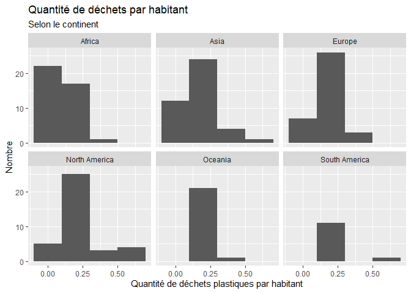
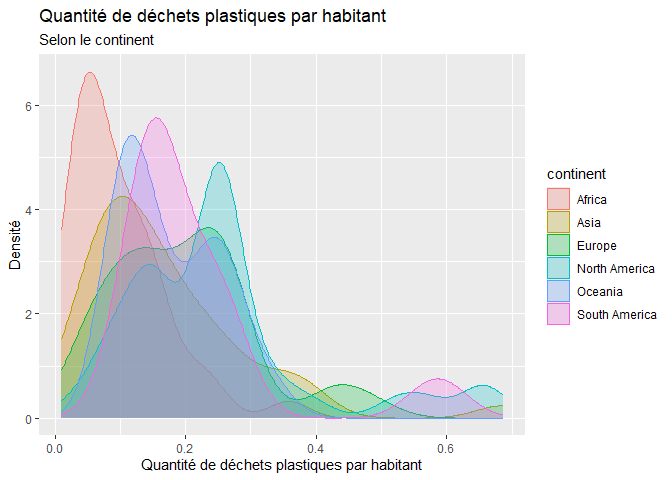
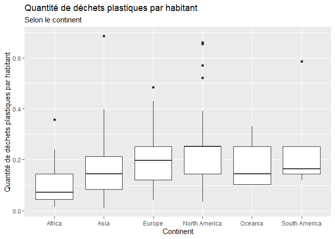
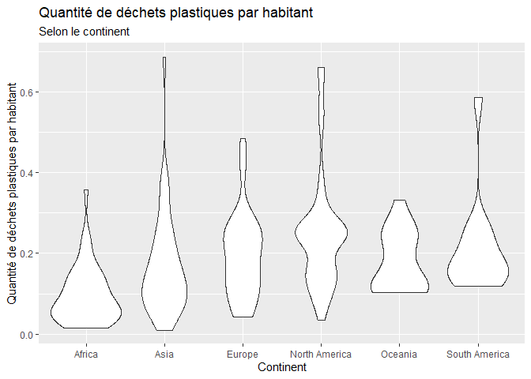
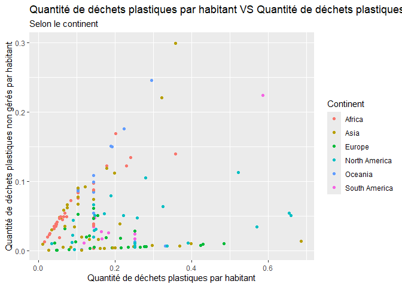
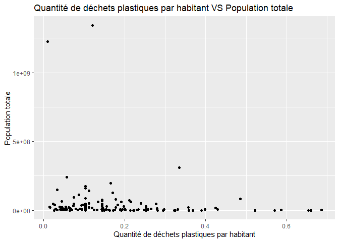
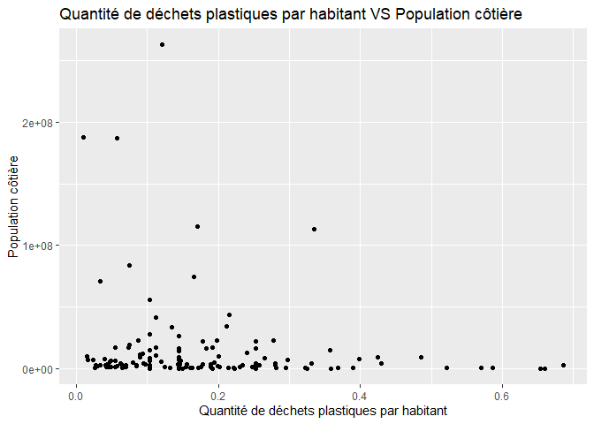
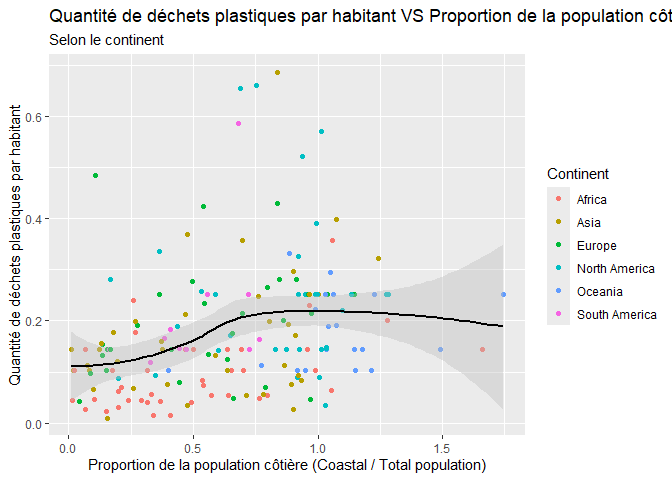

Lab 02 - Plastic waste
================
Justin Dubé
22 septembre 2025

## Chargement des packages et des données

``` r
library(tidyverse) 
```

``` r
plastic_waste <- read_csv("data/plastic-waste.csv")
```

Commençons par filtrer les données pour retirer le point représenté par
Trinité et Tobago (TTO) qui est un outlier.

``` r
plastic_waste <- plastic_waste %>%
  filter(plastic_waste_per_cap < 3.5)
```

## Exercices

### Exercice 1

``` r
ggplot(plastic_waste, aes(x = plastic_waste_per_cap)) +
  geom_histogram(binwidth = 0.2) +
  facet_wrap(~ continent) +
labs(title = "Quantité de déchets par habitant",
     subtitle = "Selon le continent",
     x = "Quantité de déchets plastiques par habitant", y = "Nombre")
```

<!-- -->

L’Afrique et l’Asie produisent globalement moins de déchets plastiques
par habitant. L’Europe, l’Océanie et l’Amérique du Sud produisent un peu
plus de déchets plastiques par habitant, alors que l’Amérique du Nord se
démarque par une production de déchets par habitant plus élevée, mais
aussi plus variable (certains pays en produisent un peu, d’autres
beaucoup).

### Exercice 2

``` r
ggplot(plastic_waste, aes(x = plastic_waste_per_cap, colour = continent, fill = continent)) +
  geom_density(alpha = 0.25) +
  labs(title = "Quantité de déchets plastiques par habitant",
     subtitle = "Selon le continent",
     x = "Quantité de déchets plastiques par habitant", y = "Densité")
```

<!-- -->

Les réglages pour la couleur (colour et fill) se retrouve dans
l’aesthetic, car se sont des paramètres qui dépendent des données. Au
contraire, le réglage pour la transparence (alpha) se retrouve dans la
géométrie (geom_density), car ce paramètre est indépendant des données.

### Exercice 3

Boxplot:

``` r
ggplot(plastic_waste, aes(x = continent, y = plastic_waste_per_cap)) +
  geom_boxplot() +
  labs(title = "Quantité de déchets plastiques par habitant",
     subtitle = "Selon le continent",
     x = "Continent", y = "Quantité de déchets plastiques par habitant")
```

<!-- -->

Violin plot:

``` r
ggplot(plastic_waste, aes(x = continent, y = plastic_waste_per_cap)) +
  geom_violin() +
  labs(title = "Quantité de déchets plastiques par habitant",
     subtitle = "Selon le continent",
     x = "Continent", y = "Quantité de déchets plastiques par habitant")
```

<!-- -->

Les boxplots résument la distribution en donnant entre autre la médiane
et la région où 50% des données se retrouvent. Les violin plots donnent
quant à eux plus d’informations sur la distribution de données. Ils
montrent la forme de la distribution, c’est-à-dire si les données sont
concentrées ou sont étalées. Ils donnent une meilleure répartition des
données contrairement aux boxplots.

### Exercice 4

``` r
ggplot(plastic_waste, aes(x = plastic_waste_per_cap, y = mismanaged_plastic_waste_per_cap, colour = continent)) +
  geom_point() +
  labs(title = "Quantité de déchets plastiques par habitant VS Quantité de déchets plastiques non gérés",
     subtitle = "Selon le continent",
     x = "Quantité de déchets plastiques par habitant", y = "Quantité de déchets plastiques non gérés par habitant", colour = "Continent")
```

<!-- -->

Avec ce graphe, on peut voir une tendance où pour plusieurs continents,
plus la production de déchets par habitant est grande, plus les déchets
sont mal gérés.

### Exercice 5

``` r
ggplot(plastic_waste, aes(x = plastic_waste_per_cap, y = total_pop)) +
  geom_point() +
  labs(title = "Quantité de déchets plastiques par habitant VS Population totale",
     x = "Quantité de déchets plastiques par habitant", y = "Population totale")
```

    ## Warning: Removed 10 rows containing missing values or values outside the scale range
    ## (`geom_point()`).

<!-- -->

``` r
ggplot(plastic_waste, aes(x = plastic_waste_per_cap, y = coastal_pop)) +
  geom_point() +
  labs(title = "Quantité de déchets plastiques par habitant VS Population côtière",
     x = "Quantité de déchets plastiques par habitant", y = "Population côtière")
```

<!-- -->

La relation la plus forte est le deuxième graphe. En fait, pour le
premier graphe, on observe que pour des villes ayant des populations
totales semblables, la quantité de déchets par habitant évoluent selon
chaque ville. Pour le deuxième graphe. On remarque que plus une ville
cotière est populeuse, moins il y a de déchets par habitant.

## Conclusion

Recréez la visualisation:

``` r
ggplot(data = plastic_waste %>% 
  mutate(coastal_pop_prop = coastal_pop / total_pop) %>%
  filter(plastic_waste_per_cap < 3), aes(x = coastal_pop_prop, y = plastic_waste_per_cap, colour = continent)) +
geom_point() +
  geom_smooth(method = "loess",
  se = TRUE,
  colour = "black",
  fill = "grey",) +
  labs(title = "Quantité de déchets plastiques par habitant VS Proportion de la population côtière",
     subtitle = "Selon le continent",
     x = "Proportion de la population côtière (Coastal / Total population)", y = "Quantité de déchets plastiques par habitant", color = "Continent")
```

    ## `geom_smooth()` using formula = 'y ~ x'

    ## Warning: Removed 10 rows containing non-finite outside the scale range
    ## (`stat_smooth()`).

    ## Warning: Removed 10 rows containing missing values or values outside the scale range
    ## (`geom_point()`).

<!-- -->

D’abord, on remarque avec ce graphe que la quantité de déchets
plastiques par habitant tend à augmenter lorsque la proportion de la
population côtière augmente. Aussi, au niveau des différents continents,
on remarque que les points pour l’Afrique et l’Asie sont généralement
sous la tendance moyenne, donc une production plus faibles de déchets.
Pour l’Océanie et l’Amérique du Sud, la production de déchets est assez
intermédiaires, car les points se retrouvent au niveau de la tendance
moyenne. Finalement, pour l’Europe et l’Amérique du Nord, la variation
des points est plus élevées, ce qui indiquent une plus grande production
de déchets.
